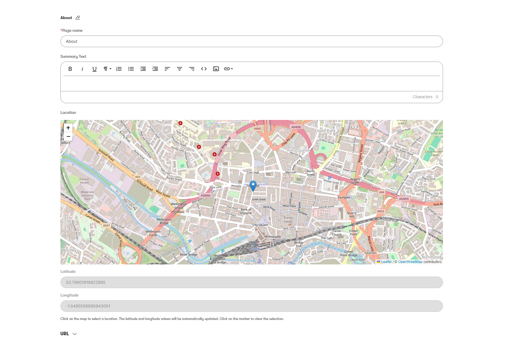
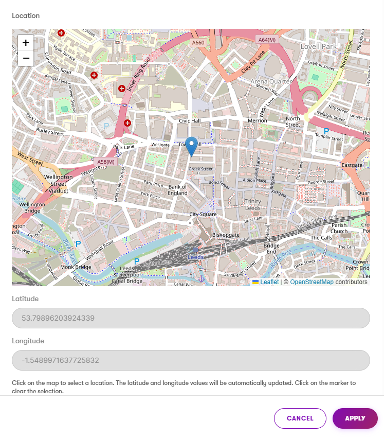

# Xperience Community: Map Location Selector

## Description

Adds a map selector UI form component for Xperience by Kentico admin site. Can be used for content type fields and page builder widget fields.

## Screenshots

The UI form component can be used for fields on a content type, and renders like this on the content tab:
<a href="src/images/content-type-property.PNG">
  
</a>

The component can also be used for widget properties and looks like this on the widget configuration window:
<a href="src/images/widget-property.PNG">
  
</a>

## Library Version Matrix

| Xperience Version | Library Version |
| ----------------- | --------------- |
| >= 28.2.0         | 1.0.0           |

## Dependencies

- [ASP.NET Core 8.0](https://dotnet.microsoft.com/en-us/download)
- [Xperience by Kentico](https://docs.xperience.io/xp/changelog)

## Package Installation

Add the package to your application using the .NET CLI

```powershell
dotnet add package XperienceCommunity.MapLocationSelector
```

## Quick Start

1. Install NuGet package above.
1. Add configuration block to the ASP.NET Core `appsettings.json` file:

   ```json
   "xperiencecommunity.maplocation": {
       "MapLatitude": "<your default latitude, e.g. 53.799009663238486>",
       "MapLongitude": "<your default longitude, e.g. -1.549048364271424>"
   }
   ```

1. Register the configuration block using `builder.Services.AddXperienceCommunityMapLocationSelector()`:

   ```csharp
   // Program.cs

   var builder = WebApplication.CreateBuilder(args);

   // ...

   builder.Services.AddXperienceCommunityMapLocationSelector(builder.Configuration);
   ```

   At this point the UI form component will be registered for fields in content types.

   The value stored in the database when saved will either be an empty string (if no location selected), or in the format of `53.799009663238486,-1.549048364271424`. The latitude and longitude are comma separated.

   If you need to use in widget properies too, then follow the next step to configure the widget.

1. Use the `MapLocationFormComponent` attribute to add a property in your widget property configuration class.

   ```csharp
   using XperienceCommunity.MapLocationSelector;

    public class ExampleWidgetProperties : IWidgetProperties
    {
        [MapLocationFormComponent(Label = "Location", Order = 1)]
        public string Location { get; set; }
    }
   ```


## Contributing

Feel free to submit issues or pull requests to the repository, this is a community package and everyone is welcome to support.

## License

Distributed under the MIT License. See [`LICENSE.md`](LICENSE.md) for more information.
