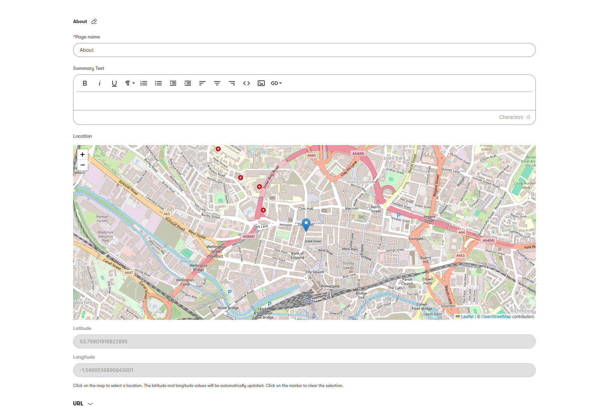
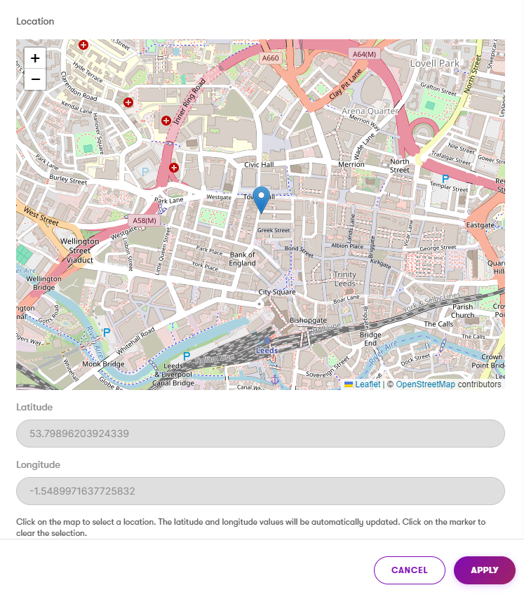

# Xperience Community: Map Location Selector

## Description

Adds map selector UI form components for Xperience by Kentico admin site. Can be used for content type fields and page builder widget fields.

This package provides **two** form components:

| Component | Map Provider | Search | Storage Format |
| --- | --- | --- | --- |
| **Map Location Selector** | OpenStreetMap (Leaflet) | Click-to-pin, manual lat/lng entry | `latitude,longitude` |
| **Google Map Location Selector** | Google Maps | Places Autocomplete, click-to-pin, reverse geocoding | JSON `{"address":"...","latitude":0,"longitude":0}` |

## Screenshots

The UI form component can be used for fields on a content type, and renders like this on the content tab:
<a href="src/images/content-type-property.PNG">
  
</a>

The component can also be used for widget properties and looks like this on the widget configuration window:
<a href="src/images/widget-property.PNG">
  
</a>

## Library Version Matrix

| Xperience Version | Library Version |
| ----------------- | --------------- |
| >= 30.11.1        | 3.0.0           |
| >= 30.11.1        | 2.0.0           |
| >= 28.2.0         | 1.0.0           |

## Dependencies

- [ASP.NET Core 8.0](https://dotnet.microsoft.com/en-us/download)
- [Xperience by Kentico](https://docs.xperience.io/xp/changelog)

## Package Installation

Add the package to your application using the .NET CLI

```powershell
dotnet add package XperienceCommunity.MapLocationSelector
```

## Quick Start

1. Install NuGet package above.
1. Add configuration block to the ASP.NET Core `appsettings.json` file:

   ```json
   "xperiencecommunity.maplocation": {
       "MapLatitude": "<your default latitude, e.g. 53.799009663238486>",
       "MapLongitude": "<your default longitude, e.g. -1.549048364271424>",
       "MapZoom": 10,
       "ManualEntry": true,
       "GoogleApiKey": "<your Google Maps API key (optional, only for Google Map component)>"
   }
   ```

1. Register the configuration block using `builder.Services.AddXperienceCommunityMapLocationSelector()`:

   ```csharp
   // Program.cs

   var builder = WebApplication.CreateBuilder(args);

   // ...

   builder.Services.AddXperienceCommunityMapLocationSelector(builder.Configuration);
   ```

   At this point both UI form components will be registered and available for fields in content types.

---

## Component 1: Map Location Selector (OpenStreetMap / Leaflet)

This is the original component using OpenStreetMap tiles via Leaflet. No API key required.

### Storage Format

The value stored in the database will either be an empty string (if no location selected), or in the format of `53.799009663238486,-1.549048364271424`. The latitude and longitude are comma separated.

### Widget Usage

Use the `MapLocationFormComponent` attribute on a widget property:

```csharp
using XperienceCommunity.MapLocationSelector;

public class ExampleWidgetProperties : IWidgetProperties
{
    [MapLocationFormComponent(Label = "Location", Order = 1)]
    public string Location { get; set; }
}
```

### Parsing the Value

```csharp
if (!string.IsNullOrWhiteSpace(location))
{
    var parts = location.Split(',');
    if (parts.Length == 2)
    {
        var latitude = double.Parse(parts[0]);
        var longitude = double.Parse(parts[1]);
    }
}
```

---

## Component 2: Google Map Location Selector

This component uses the Google Maps JavaScript API with Places Autocomplete for address search, click-to-pin on the map, and reverse geocoding.

### Prerequisites

You need a Google Maps API key with the following APIs enabled:

- **Maps JavaScript API**
- **Places API**

Get your API key from the [Google Cloud Console](https://console.cloud.google.com/apis/credentials).

### Configuration

Add the `GoogleApiKey` to the `xperiencecommunity.maplocation` section in `appsettings.json`:

```json
"xperiencecommunity.maplocation": {
    "MapLatitude": 53.799009,
    "MapLongitude": -1.549048,
    "MapZoom": 10,
    "GoogleApiKey": "YOUR_GOOGLE_MAPS_API_KEY"
}
```

> **Tip:** For security, use [user secrets](https://learn.microsoft.com/en-us/aspnet/core/security/app-secrets) or environment variables for the API key instead of committing it to `appsettings.json`.

### Storage Format

The value is stored as a JSON string:

```json
{"address":"123 Main St, City, Country","latitude":53.799009,"longitude":-1.549048}
```

### Widget Usage

Use the `GoogleMapLocationFormComponent` attribute on a widget property:

```csharp
using XperienceCommunity.MapLocationSelector;

public class ExampleWidgetProperties : IWidgetProperties
{
    [GoogleMapLocationFormComponent(Label = "Location", Order = 1)]
    public string Location { get; set; }
}
```

### Content Type Field Usage

When creating a content type in the Xperience admin, select **"Google Map location selector"** as the form component for a text field.

### Parsing the Value

```csharp
using System.Text.Json;
using XperienceCommunity.MapLocationSelector;

if (!string.IsNullOrWhiteSpace(location))
{
    var mapData = JsonSerializer.Deserialize<GoogleMapLocationData>(location);
    // mapData.Address  - "123 Main St, City, Country"
    // mapData.Latitude - 53.799009
    // mapData.Longitude - -1.549048
}
```

### Features

- **Address Search** - Type an address and select from Google Places Autocomplete suggestions
- **Click-to-Pin** - Click anywhere on the map to place a marker
- **Reverse Geocoding** - When clicking on the map, the address is automatically resolved
- **Clear Button** - Remove the selected location with one click
- **Coordinate Display** - Shows the current latitude and longitude below the map
- **Disabled Mode** - Respects the form's edit mode (read-only when disabled)

---

## Configuration Reference

| Property | Type | Default | Description |
| --- | --- | --- | --- |
| `MapLatitude` | `double` | `0` | Default map center latitude |
| `MapLongitude` | `double` | `0` | Default map center longitude |
| `MapZoom` | `int` | `15` | Default zoom level (OpenStreetMap) / `10` (Google Maps) |
| `ManualEntry` | `bool` | `false` | Allow manual lat/lng text input (OpenStreetMap component only) |
| `GoogleApiKey` | `string` | `null` | Google Maps API key (Google Maps component only) |

## Contributing

Feel free to submit issues or pull requests to the repository, this is a community package and everyone is welcome to support.

## License

Distributed under the MIT License. See [`LICENSE.md`](LICENSE.md) for more information.
